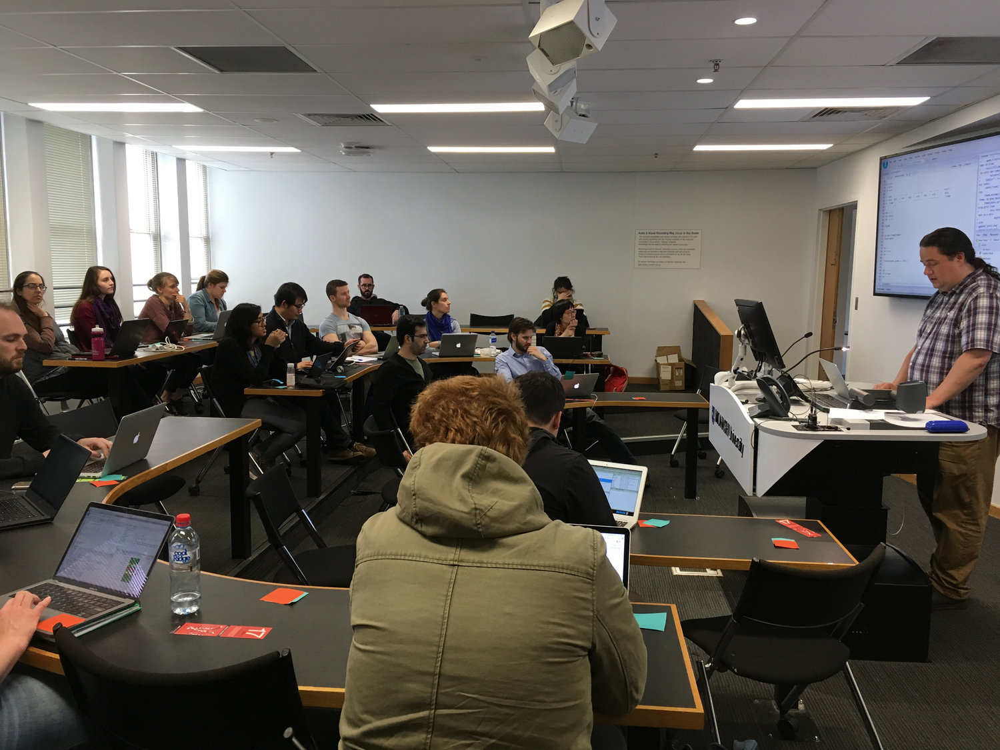
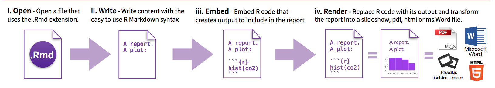
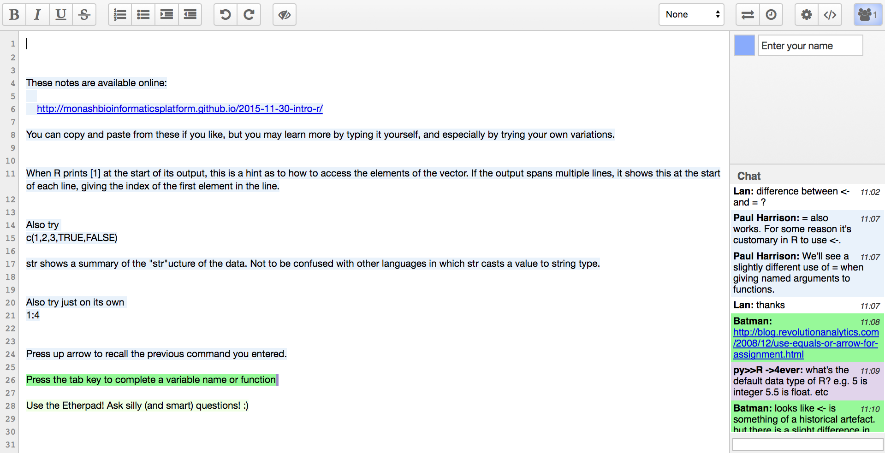
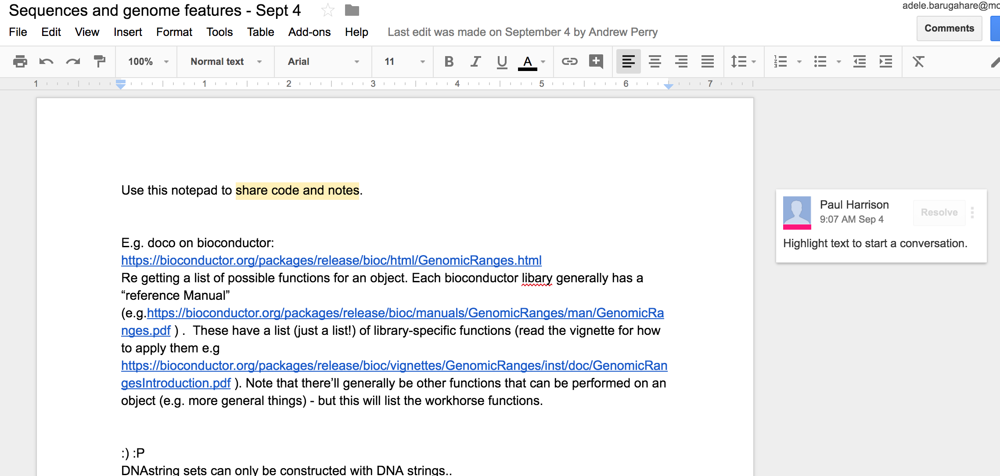

## MBP training format

Heavily inspired by Software Carpentry:

* 2-3 trainers + additional helpers

* Sticky notes

* Collaborative notepad

* User accounts on a training server

* Follow-up survey

## 

<center></center>

## Courses We Have Developed

Full day workshops:

* [Intro to R](https://monashbioinformaticsplatform.github.io/r-intro/)

* [RNAseq DE analysis using R](http://monashbioinformaticsplatform.github.io/RNAseq-DE-analysis-with-R/)

* [Best Practices in R/Advanced R](https://monashbioinformaticsplatform.github.io/r-more/)

Three hour sessions:

* Working with sequences and genomic features

## Material Adaptation

* Our course material is on GitHub under a creative commons license

* Have adapted some Software Carpentry material for our own course 

* We've also forked online material for a Python course in the past

<center></center>

## Tools and technology

* Server set-up and management: [bio-ansible](https://github.com/MonashBioinformaticsPlatform/bio-ansible)

* Training interfaces: R-Studio Server and Jupyter Hub

* Training material: R Markdown, Jupyter Notebooks, Makefiles

* Collaborative notepads: Etherpad and Google Docs

* Version control and file hosting: Git/GitHub Pages

## Training Server

* Managed by [bio-ansible](https://github.com/MonashBioinformaticsPlatform/bio-ansible) - open source tool for deploying bioinformatics servers

* Running R-Studio/Jupyter on a training server means that partipants just need a web browser

* In theory, should be smooth to get participants going but there are always new problems that crop up

<center></center>

## Training Material - R Markdown/Jupyter Notebooks

Markdown is a powerful “language” for writing different kinds of documents, such as PDF or HTML in an efficient way, but markdown documents can also be published as is. The underlying idea for markdown is that it is easy to write and easy to read.

R Markdown builds on Markdown, allowing for code to be embedded and executed within the body of a Markdown document. Jupyter Notebooks also integrate Markdown and cell blocks that contain code.

<center></center>

## Why We Use R Markdown

* Code chunks: code is easy to test and very easily embeded with text in one document.

* Fully reproducible

* Easy to adapt by another person

* Actively being developed by R-Studio team which means it plays well with other packages developed by them

<center></center>

##

* Versatile - can produce different document formats from the one source text file e.g web pages, pdfs, Word documents, slideshow presentations.

<center></center>

## R Markdown in Training

* Generate html files and slides containing learning materials from R Markdown files

* Each lesson contained to a single R Markdown file

* Host on GitHub Pages

* Stylesheets and YAML files to control appearance and document output uniformly across multiple files

* Makefile to clean and rebuild html pages as needed

## Collaborative Notepads

During the workshop:

* Etherpad/Google Docs: 'collaborative notepad'.

* Use to share answers to challenges, write notes and ask questions.

* Both free to use

<center></center>

## Etherpad

Etherpad - Open source, actively developed

Latest version runs on `node` (server-side javascript).

Many free servers available. We've had problems when using the beta version - install locally!

Easy to set up for yourself, for full control over settings:

```
git clone git://github.com/ether/etherpad-lite.git
cd etherpad-lite
bin/run.sh
```

(Will want to make some to changes `settings.json`, especially use a better database than the default `"dirty"`. `"sqlite"` should be fine.)

## Etherpad

<center></center>

## Google Doc

Workshop attendees seem to interact less with it

Little discussion, only submission of answers

Notes to self: 

* remember to enable editing for attendees

* Also open access to attendees that aren't using an institute email :)

##

<center></center>

## In Summary

Training server: bio-ansible ensures everyone has access to same materials and environment

R Markdown for developing training material

Version control training material with Git

In workshops: shared notepads with Etherpad
